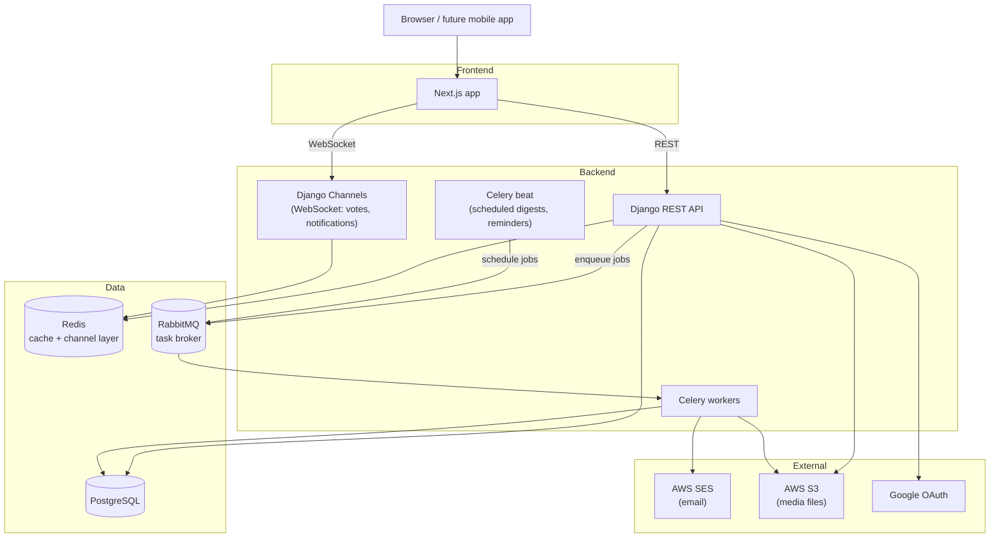

# Launchpad

A site where founders launch new products on a chosen day and people vote on them.
Best products of the day rise to the top. Think "daily list of what launched today."

See the full brief: [`docs/01-client-brief.md`](docs/01-client-brief.md).

## Who's it for

- **Visitors** – browse, no account needed
- **Members** – vote, comment, follow
- **Founders** – members who submitted a product
- **Reviewers** – staff who approve/reject submissions
- **Admins** – staff, full control (accounts, takedowns)

Full feature list: [`docs/02-features.md`](docs/02-features.md).

## Tech stack

**Confirmed:**
- Backend / API — Django + Django REST Framework
- Frontend — Next.js (TypeScript)
- Database — PostgreSQL
- Cache / real-time — Redis

**Decided, open to revisit:**
- Task queue broker — RabbitMQ (durable, survives worker/provider outages)
- Task runner — Celery (works with RabbitMQ, handles scheduled + retryable jobs)
- Email — AWS SES

**Suggested additions:**
- File storage — AWS S3 (logos, screenshots, avatars)
- Real-time updates — Django Channels + Redis (live vote counts, notification bell)
- Search — Postgres full-text search first; move to Meilisearch/Elasticsearch if it's not fast enough
- Error tracking — Sentry
- CI — GitHub Actions
- Hosting — Vercel (frontend), AWS ECS/Fargate or Render (backend + workers)
- Containers — Docker for local dev + deploys

Decisions and the reasoning behind them live in
[`docs/03-architecture-decisions.md`](docs/03-architecture-decisions.md).

## Architecture



**Flow in short:**
- Next.js talks to Django over REST for normal requests, WebSocket for live updates.
- Django writes to Postgres, uses Redis for caching and the channel layer.
- Slow or "must not be lost" work (emails, digests, export files) goes through RabbitMQ to Celery workers, not the request/response cycle.
- Media files go to S3, not the app server.

## Repo layout

```
launchpad/
├── launchpad-backend/     # Django + DRF
├── launchpad-frontend/    # Next.js
├── docs/                  # brief, features, decisions, db schema
├── AGENTS.md              # conventions any coding agent should follow
└── CLAUDE.md              # Claude-specific notes, points to AGENTS.md
```

## Docs

- [`docs/01-client-brief.md`](docs/01-client-brief.md) – original client brief
- [`docs/02-features.md`](docs/02-features.md) – features by user role
- [`docs/03-architecture-decisions.md`](docs/03-architecture-decisions.md) – ADR log, kept up to date as we build
- [`docs/04-db-diagram.md`](docs/04-db-diagram.md) – DBML schema

## Getting started

Needs Postgres, Redis, and RabbitMQ running locally (or point `DATABASE_URL` /
`REDIS_URL` / `CELERY_BROKER_URL` in `.env` at wherever they're running).

### Backend

```bash
cd launchpad-backend
python3 -m venv .venv && source .venv/bin/activate
pip install -r requirements/dev.txt
cp .env.example .env   # edit if your local Postgres/Redis/RabbitMQ differ
python manage.py migrate
python manage.py createsuperuser
python manage.py runserver
```

Runs on Django 4.2 LTS — the only Python available locally is 3.9, and Django 5
needs 3.10+. Worth upgrading Python later to move to Django 5.

### Frontend

```bash
cd launchpad-frontend
npm install
cp .env.example .env.local
npm run dev
```

Runs on Next.js 16 (TypeScript, App Router, Tailwind).
